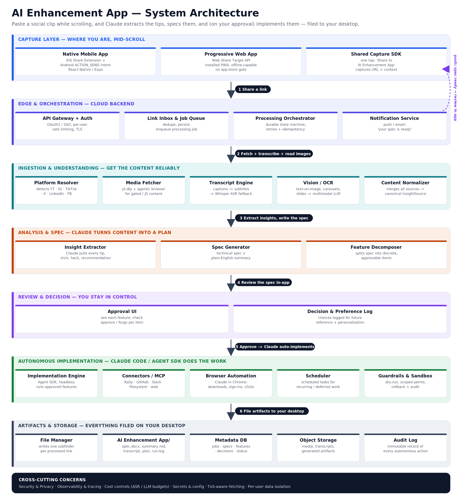

# AI Enhancement App

Share a social post while you're scrolling. Get back a plain-English summary, an
itemised plan, and — for the items you approve — the work actually done, filed
into a folder on your desktop.

This is a working implementation of the **AI Enhancement App** described in the
[Business Requirements Document](docs/AI_Enhancement_App_BRD.docx) and
[Technical Specification](docs/AI_Enhancement_App_Technical_Spec.docx) in `docs/`.



---

## The problem it solves

Discovery happens in *consume mode* — a good Claude tip scrolls past at 11pm.
Acting on it needs *work mode* — sitting down, re-watching, translating advice
into setup. The two almost never coincide, so the saved link becomes a
placeholder for a good intention that decays.

This closes the gap: one tap at the moment of discovery, one keep-or-skip
decision later, and the machine does the rest.

```
capture → understand → analyse & spec → notify → review & decide → implement → file artifacts
```

---

## Quickstart

**It runs with no API keys.** With an empty `.env` the full loop works
end-to-end using a built-in rule-based analyzer — real extraction, real specs,
real implementation, no model calls. Adding keys upgrades the same pipeline in
place.

```bash
git clone <this repo> && cd AI_enhancement-
npm install
cp .env.example .env
npm run build
npm start
```

Open <http://localhost:4000>, create an account, and paste a link on the
**Capture** tab.

For development with hot reload:

```bash
npm run dev     # API on :4000, PWA on :5173
```

### Turning on the full pipeline

| Add to `.env` | What it unlocks |
| --- | --- |
| `ANTHROPIC_API_KEY=sk-ant-…` | Claude does the insight extraction, spec writing and artifact authoring instead of the rule-based analyzer |
| `ASR_PROVIDER=openai` + `OPENAI_API_KEY=…` | Speech-to-text for clips with no caption track (most Reels and TikToks) |
| `VISION_PROVIDER=claude` | Reads text baked onto images and carousel slides |
| `yt-dlp` on `PATH` | Author captions, auto-captions and audio download — the cleanest, highest-fidelity extraction path |
| `ffmpeg` on `PATH` | Frame sampling so on-screen text in videos gets read |
| `ENABLE_BROWSER_AGENT=true` + `npm i playwright` | Renders JavaScript-heavy pages as a last resort |

Every one of these is optional and independently useful. The **Settings** screen
shows exactly which are live on your deployment, so the app is always honest
about what will happen to a link.

---

## One-tap capture from your phone

The PWA registers as a **Web Share Target**. Install it to your home screen and
"AI Enhancement App" appears in the normal share sheet inside Instagram, TikTok,
YouTube, X, LinkedIn and Facebook.

- **iOS (Safari):** Share → *Add to Home Screen*
- **Android (Chrome):** menu → *Install app*

Share targets require an installed PWA served over HTTPS (or localhost). The
service worker handles the share **offline**: it queues the link on-device and
submits it when connectivity returns, so a capture is never lost.

Android frequently delivers the shared link inside the `text` field rather than
`url`, and iOS often sends `"caption text… https://link"`. Both are handled — the
app pulls the URL out of whatever field it lands in.

---

## What you get per link

Every processed link produces one folder under a single `AI Enhancement App/`
folder, exactly as specified in §11.1 of the technical spec:

```
AI Enhancement App/
├── _index.md                          # every link, with status
├── _instructions.md                   # standing instructions accumulated across links
├── _settings.md                       # setting changes with exact steps
├── _skills/                           # reusable skills, ready to drop into Claude Code
└── 2026-07-30__instagram__morning-inbox-summary/
    ├── 00_source.json                 # url, platform, capture time, shared text
    ├── 01_transcript.vtt              # captions/subtitles when time-coded
    ├── 01_transcript.txt              # normalized plain text
    ├── 02_extracted-insights.json     # every segment, with provenance + confidence
    ├── 03_summary.md                  # plain-English "what this post tells you to do"
    ├── 04_spec.md                      # the technical spec for this link
    ├── 05_implementation-plan.md      # itemised plan + methods + prerequisites
    ├── 06_decisions.json              # your per-item approve/forgo choices
    ├── 07_run-log.md                  # every autonomous action taken + result
    ├── artifacts/                     # generated files, downloads, created skills
    └── media/                         # cached audio / frames (retention-limited)
```

Three ways to get these onto your machine:

1. **Desktop bridge** — `npm run bridge` on your own computer. Polls and writes
   the folders to `~/Desktop/AI Enhancement App`. No inbound connection needed.
2. **Export everything** — one button in Settings, downloads the whole tree as a zip.
3. **Per-link zip** — from any link's detail screen.

---

## You stay in control

Nothing runs until you check it. Each proposed improvement is a separate
approve/skip decision, **defaulting to unselected**, with the source excerpts it
was drawn from shown inline so you can check the claim before agreeing to it.

Past that gate, the **trust dial** decides what happens:

| Posture | Behaviour |
| --- | --- |
| Ask me every time | Approval alone never runs anything |
| Just do the safe ones *(default)* | Skills, instructions and generated files run on approval; schedules, downloads and connectors ask again |
| Just do it | Everything you approve runs immediately |

Plus a **Preview** button that computes what would change without changing it,
an **Undo** on anything reversible, and a run log recording every action.

The engine only ever holds the permissions an item's *type* implies, recomputed
server-side — a model response cannot widen what a run is allowed to touch. It
refuses fetches to private/loopback addresses, never executes shell commands
(it prepares and explains them for you to run), and confines every write to your
own artifact folder.

---

## What it does *not* do

Stated plainly, because both source documents are explicit about it:

- **It never invents advice.** A post with no actionable content returns "no
  actionable items found" and files a minimal record. This is a tested, expected
  outcome, not a failure.
- **It does not circumvent anything.** No paywalls, DRM, private-account gates or
  rate-limit evasion. It only requests what a platform serves to a signed-out
  viewer. Coverage of private or protected content is limited by design.
- **It does not act outside your own environment.** Autonomous implementation is
  scoped to your AI setup and connected tools.

---

## Documentation

| Document | What's in it |
| --- | --- |
| [docs/ARCHITECTURE.md](docs/ARCHITECTURE.md) | How the seven layers map onto the code |
| [docs/API.md](docs/API.md) | Every endpoint, with request/response shapes |
| [docs/DEPLOYMENT.md](docs/DEPLOYMENT.md) | Docker, hosting, HTTPS, backups, hardening |
| [docs/TRACEABILITY.md](docs/TRACEABILITY.md) | Every BRD requirement → where it is implemented and tested |
| [docs/STATUS.md](docs/STATUS.md) | What is built, what is deliberately scoped out, what is next |

---

## Repository layout

```
packages/
├── shared/          types, URL/folder-naming rules, markdown renderer
├── server/          API, orchestrator, ingestion, analysis, implementation engine
├── web/             the PWA — capture, review, digest, settings
└── desktop-bridge/  dependency-free CLI that syncs folders to your desktop
docs/                architecture, API, deployment, traceability, source documents
scripts/             icon generation
```

## Tests

```bash
npm test
```

77 tests covering the extraction waterfall (captioned video, rolling-window
auto-captions, silent carousels, audio-only clips), analyzer fidelity including
the "nothing actionable" case, the full capture → spec → approve → implement
loop, per-user isolation, path traversal, scope containment, dry-run, budgets
and audit completeness.

## Licence

MIT — see [LICENSE](LICENSE).
